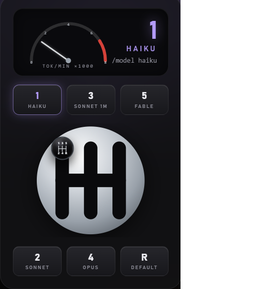

# Claude Shifter — Landing Page



A single-page marketing site for **Claude Shifter**, the car-style gear shifter that
switches your Claude Code model. Built with [Astro](https://astro.build), static output.

## Run it

```powershell
npm install
npm run dev       # http://localhost:4321
```

## Build

```powershell
npm run build
npm run preview
```

## Deploy

Configured for Vercel (`@astrojs/vercel` adapter + `vercel.json`):

```powershell
npm install -g vercel
vercel --prod
```

Or import the repo at [vercel.com/new](https://vercel.com/new) for auto-deploys on push.

Payment isn't wired up yet — the "Download for Windows" button links to a placeholder
`/buy` page for now.
